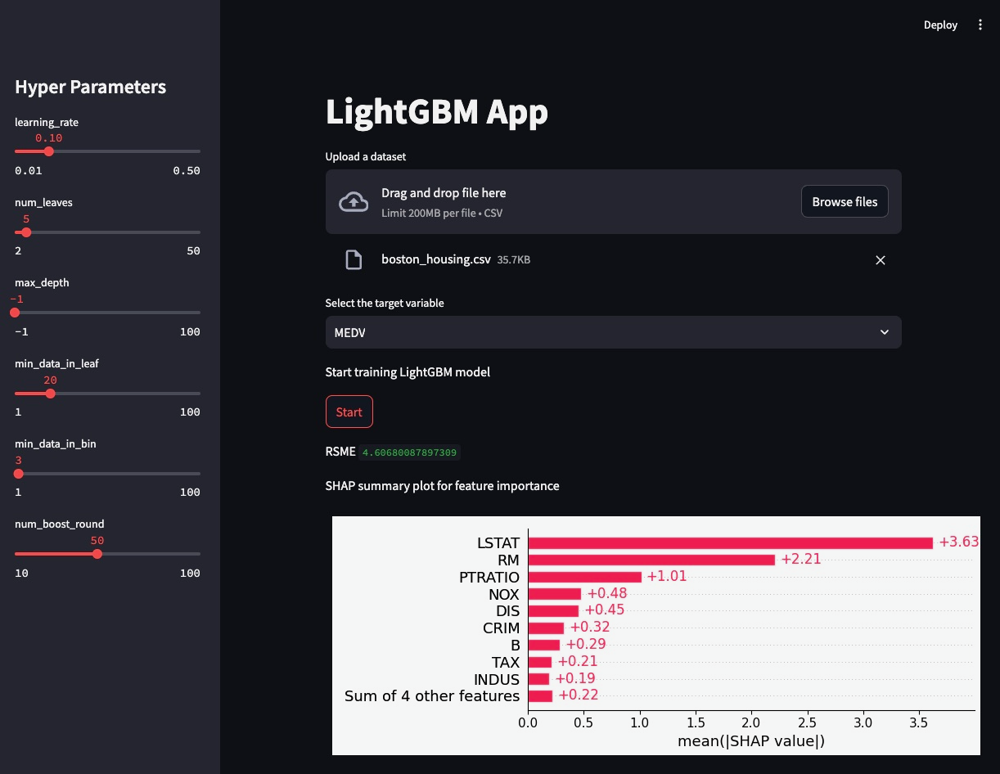

# lightgbm-app

# Overview

This is a simple web application with Streamlit that uses the LightGBM model.



# Setup

Install the required packages:

```bash
pip install -r requirements.txt
```

# Usage

Run the web application:

```bash
streamlit run lightgbm-app.py
```

# License

This project is licensed under the MIT License - see the [LICENSE](LICENSE) file for details.

