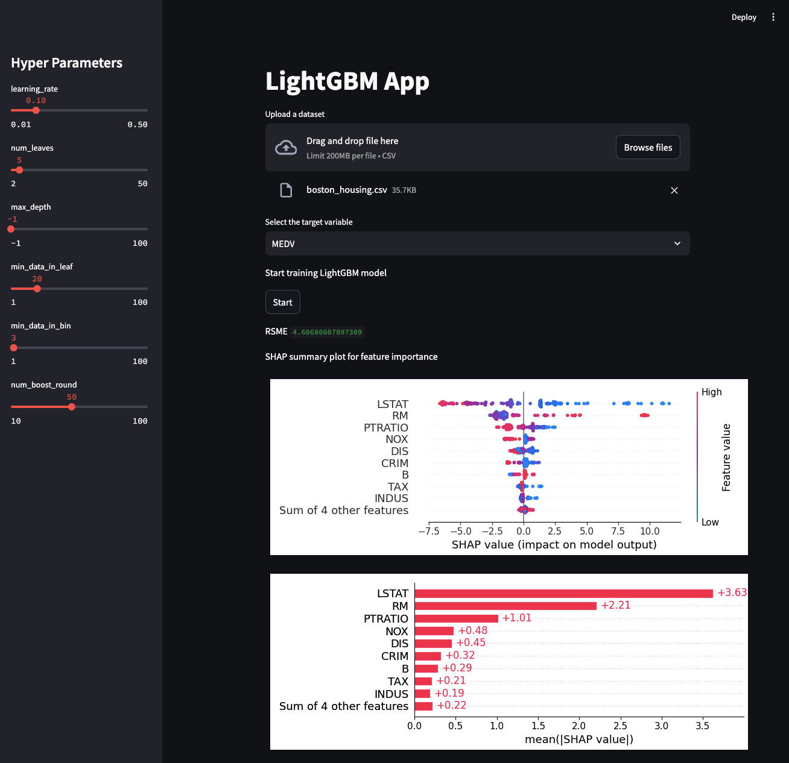

# lightgbm-app

This is a simple web application with Streamlit that uses the LightGBM model.



# Requirements

* Python 3.10
* LightGBM 4.4.0
* SHAP 0.45.1
* Matplotlib 3.9.0
* Streamlit 1.36.0
* Streamlit-SHAP 1.0.2

# Setup

Install the required packages:

```bash
rye sync
```

# Usage

Run the web application:

```bash
rye run streamlit run ./src/lightgbm_app/main.py
```

# License

This project is licensed under the MIT License - see the [LICENSE](LICENSE) file for details.

